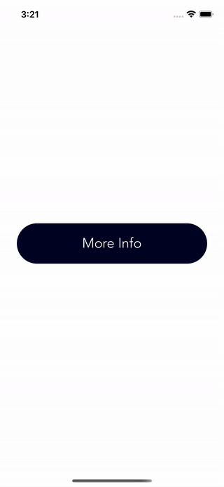

# Lifesum-Challenge

- [Implement Lifesum](https://api.lifesum.com/) 
- Swift
- MVVM
- URLSession
- Clean Architecture
- No Storyboards and no XIBs
- AutoLayout with Constraints
- Human Interface Guidelines
- Functional Reactive Programming (RxSwift)
